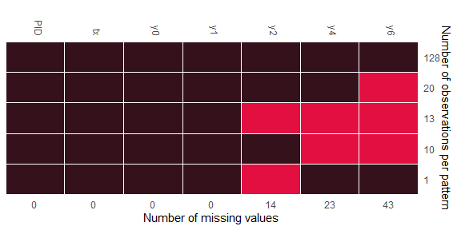

### Example: Continuous data imputation through GLM

The example data, which was from an antidepressant clinical trial, can be found in [DIA
Missing Data](https://www.lshtm.ac.uk/research/centres-projects-groups/missing-data#dia-missing-data) 
webpage. Original data was from an antidepressant
clinical trial with four treatments; two doses of an experimental
medication, a positive control, and placebo. Hamilton 17-item rating
scale for depression (HAMD17) was observed at baseline and its change
scores at weeks 1, 2, 4, 6, and 8
(<a href="https://doi.org/10.1097/01.jcp.0000132448.65972.d9"> Goldstein
et al. 2004</a>). To mask the real data Week-8 observations were
removed. The example data is a sub-sample of the original data: two arms
were created; the original placebo arm and a “drug arm” created by
randomly selecting patients from the three non-placebo arms.

    data(antidep)
    head(antidep) %>% kbl(align = "c") %>% 
      kable_classic(full_width = F, html_font = "Cambria") %>%
      column_spec(1:2, width = "2cm") %>%
      add_header_above(c(" " = 1, " "=1, "Responses at the baseline, week 1, 2, 4, and 6" = 5))

<table class=" lightable-classic" style="border-top: 2px solid #111111;border-bottom: 2px solid #111111;
	font-family: Cambria; width: auto !important; margin-left: auto; margin-right: auto;">
<thead style="border-bottom: 2px solid #111111;">
<tr>
<th style="empty-cells: hide;" colspan="1">
</th>
<th style="empty-cells: hide;" colspan="1">
</th>
<th style="border-bottom: 2px solid #111111; padding-bottom:0; padding-left:3px;padding-right:3px;text-align: center; " colspan="5">
Responses at the baseline, week 1, 2, 4, and 6
</th>
</tr>
<tr style="border-bottom: 2px solid #111111">
<th style="text-align:center;">
PID
</th>
<th style="text-align:center;">
tx
</th>
<th style="text-align:center;">
y0
</th>
<th style="text-align:center;">
y1
</th>
<th style="text-align:center;">
y2
</th>
<th style="text-align:center;">
y4
</th>
<th style="text-align:center;">
y6
</th>
</tr>
</thead>
<tbody>
<tr>
<td style="text-align:center;width: 2cm; ">
1503
</td>
<td style="text-align:center;width: 2cm; ">
1
</td>
<td style="text-align:center;">
32
</td>
<td style="text-align:center;">
-11
</td>
<td style="text-align:center;">
-12
</td>
<td style="text-align:center;">
-13
</td>
<td style="text-align:center;">
-15
</td>
</tr>
<tr>
<td style="text-align:center;width: 2cm; ">
1507
</td>
<td style="text-align:center;width: 2cm; ">
0
</td>
<td style="text-align:center;">
14
</td>
<td style="text-align:center;">
-3
</td>
<td style="text-align:center;">
0
</td>
<td style="text-align:center;">
-5
</td>
<td style="text-align:center;">
-9
</td>
</tr>
<tr>
<td style="text-align:center;width: 2cm; ">
1509
</td>
<td style="text-align:center;width: 2cm; ">
1
</td>
<td style="text-align:center;">
21
</td>
<td style="text-align:center;">
-1
</td>
<td style="text-align:center;">
-3
</td>
<td style="text-align:center;">
-5
</td>
<td style="text-align:center;">
-8
</td>
</tr>
<tr>
<td style="text-align:center;width: 2cm; ">
1511
</td>
<td style="text-align:center;width: 2cm; ">
0
</td>
<td style="text-align:center;">
21
</td>
<td style="text-align:center;">
-5
</td>
<td style="text-align:center;">
-3
</td>
<td style="text-align:center;">
-3
</td>
<td style="text-align:center;">
-9
</td>
</tr>
<tr>
<td style="text-align:center;width: 2cm; ">
1513
</td>
<td style="text-align:center;width: 2cm; ">
1
</td>
<td style="text-align:center;">
19
</td>
<td style="text-align:center;">
5
</td>
<td style="text-align:center;">
NA
</td>
<td style="text-align:center;">
NA
</td>
<td style="text-align:center;">
NA
</td>
</tr>
<tr>
<td style="text-align:center;width: 2cm; ">
1514
</td>
<td style="text-align:center;width: 2cm; ">
0
</td>
<td style="text-align:center;">
21
</td>
<td style="text-align:center;">
2
</td>
<td style="text-align:center;">
NA
</td>
<td style="text-align:center;">
NA
</td>
<td style="text-align:center;">
NA
</td>
</tr>
</tbody>
</table>

Missing pattern is displayed in the following plot:

Figure 1. Missing pattern of antidepressant data

The planned statistical method to analyze this endpoint was
mixed-effects model with last-observation-carry-forward (LOCF) as the
imputation method. In this example, missing values are imputed with GLM
models. This is implemented through `family` argument, say,
`family = gaussian()` (its default link is `identity`). The same
imputation setting is applied for imputing `y2` and `y4`, i.e. argument
`models` is set to be `glm_gaussian_identity`. We run the GLM imputation
model with an adaptation of 10000 and 2000 iterations for 4 chains.
Chains run in parallel, which is set through `doFuture` package:

    registerDoFuture()
    plan(multisession(workers = 4))

    an.test = remiod(formula=y6 ~ tx + y0 + y1 + y2 + y4, data=antidep, family = gaussian(),
                     models = c(y2="glm_gaussian_identity",y4="glm_gaussian_identity"),
                     n.iter = 100000,  n.chains = 4, n.adapt = 10000, thin=100,
                     algorithm = "jags", trtvar = 'tx', method="MAR", mess=TRUE, warn=FALSE)

    plan(sequential)

The following plots show trace plots and the estimated intervals as
shaded areas under the posterior density curves for the parameters of
treatment variable `tx` in imputation models:
<ul>
<li>
`beta[2]` is the coefficient of `tx` in imputation model
`y6 ~ tx + y0 + y1 + y2 + y4`;
</li>
<li>
`alpha[2]` is the coefficient of `tx` in imputation model
`y4 ~ tx + y0 + y1 + y2`;
</li>
<li>
`alpha[7]` is the coefficient of `tx` in imputation model
`y2 ~ tx + y0 + y1`;
</li>
</ul>

The specified set of parameters can be submitted through argument
`subset` with keyword `selected_vars` (alternatively, keyword
`selected_parms` can be used):

    mcsub = get_subset(object = an.test$mc.mar, subset=c(selected_vars = list("tx")))

    color_scheme_set("purple")
    mcmc_trace(mcsub, facet_args = list(ncol = 1, strip.position = "left"))

Figure 2. Traceplot for coefficients of `tx` in imputation models

    mcmc_areas(
      mcsub, 
      prob = 0.95, # 95% intervals
      prob_outer = 0.99, 
      point_est = "mean"
    )

Figure3. Intervals under the estimated posterior density curves for coefficients
of `tx` in imputation models

To obtain jump-to-reference analysis, we extract MI data with
`method="J2R"`, and pool analysis results with `miAnalyze`:

    j2r = extract_MIdata(object=an.test, method="J2R", M=1000, minspace=4)
    res.j2r = miAnalyze(formula = y6 ~ y0 + tx, data = j2r, family = gaussian())

    data.frame(res.j2r$Est.pool) %>% select(-6) %>%
      mutate_if(is.numeric, format, digits=4,nsmall = 0) %>%
      kbl(align = "c") %>% 
      column_spec(1:6, width = "3cm") %>%
      kable_classic(full_width = F, html_font = "Cambria")

<table class=" lightable-classic" style="border-top: 2px solid #111111;border-bottom: 2px solid #111111;
	font-family: Cambria; width: auto !important; margin-left: auto; margin-right: auto;">
<thead>
<tr>
<th style="text-align:left;">
</th>
<th style="text-align:center;">
Estimate
</th>
<th style="text-align:center;">
SE
</th>
<th style="text-align:center;">
CI.low
</th>
<th style="text-align:center;">
CI.up
</th>
<th style="text-align:center;">
t
</th>
</tr>
</thead>
<tbody>
<tr style="border-top: 2px solid #111111;">
<td style="text-align:left;width: 3cm; ">
(Intercept)
</td>
<td style="text-align:center;width: 3cm; ">
1.0433
</td>
<td style="text-align:center;width: 3cm; ">
1.82704
</td>
<td style="text-align:center;width: 3cm; ">
-2.5376
</td>
<td style="text-align:center;width: 3cm; ">
4.6243
</td>
<td style="text-align:center;width: 3cm; ">
0.5711
</td>
</tr>
<tr>
<td style="text-align:left;width: 3cm; ">
y0
</td>
<td style="text-align:center;width: 3cm; ">
-0.3292
</td>
<td style="text-align:center;width: 3cm; ">
0.09697
</td>
<td style="text-align:center;width: 3cm; ">
-0.5192
</td>
<td style="text-align:center;width: 3cm; ">
-0.1391
</td>
<td style="text-align:center;width: 3cm; ">
-3.3945
</td>
</tr>
<tr>
<td style="text-align:left;width: 3cm; ">
tx
</td>
<td style="text-align:center;width: 3cm; ">
-2.3558
</td>
<td style="text-align:center;width: 3cm; ">
1.04973
</td>
<td style="text-align:center;width: 3cm; ">
-4.4133
</td>
<td style="text-align:center;width: 3cm; ">
-0.2984
</td>
<td style="text-align:center;width: 3cm; ">
-2.2442
</td>
</tr>
</tbody>
</table>

### Reference
Wang and Liu. 2022. “Remiod: Reference-Based Controlled Multiple Imputation of Longitudinal Binary and Ordinal Outcomes with
Non-Ignorable Missingness.” [*arXiv 2203.02771*](https://arxiv.org/abs/2203.02771).