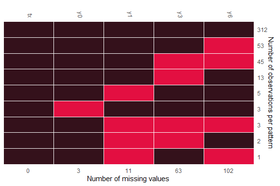

## Example: Binary data imputation

In this example, we use the binary data from [Schizophrenia](https://hedeker.people.uic.edu/ml.html) data from
NIMH study, i.e. `schizob`, which is included in the package. As
described in [Wang and Liu (2022)](https://arxiv.org/abs/2203.02771),
the original response variable was in numerical scale. The binary
response was created using a cut-point of 3.5. The data is in a wide
format. Please note that all binary variables which is set to be imputed
should be converted into `factor` variables.

    data(schizob)
    head(schizob) %>% kbl(align = "c") %>% 
      kable_classic_2(full_width = F, html_font = "Cambria") %>%
      column_spec(1, width = "2cm") %>%
      add_header_above(c(" " = 1, "Responses at the baseline, week 1, week 3, and week 6" = 4))

<table class=" lightable-classic-2" style="border-top: 2px solid #111111;border-bottom: 2px solid #111111;
	font-family: Cambria; width: auto !important; margin-left: auto; margin-right: auto;">
<thead style="border-bottom: 2px solid #111111;">
<tr>
<th style="empty-cells: hide;" colspan="1">
</th>
<th style="border-bottom: 2px solid #111111; padding-bottom:0; padding-left:3px;padding-right:3px;text-align: center; " colspan="4">
Responses at the baseline, week 1, week 3, and week 6
</th>
</tr>
<tr style="border-bottom: 2px solid #111111;">
<th style="text-align:center;">
tx
</th>
<th style="text-align:center;">
y0
</th>
<th style="text-align:center;">
y1
</th>
<th style="text-align:center;">
y3
</th>
<th style="text-align:center;">
y6
</th>
</tr>
</thead>
<tbody>
<tr>
<td style="text-align:center;width: 2cm; ">
1
</td>
<td style="text-align:center;">
1
</td>
<td style="text-align:center;">
0
</td>
<td style="text-align:center;">
0
</td>
<td style="text-align:center;">
1
</td>
</tr>
<tr>
<td style="text-align:center;width: 2cm; ">
1
</td>
<td style="text-align:center;">
1
</td>
<td style="text-align:center;">
0
</td>
<td style="text-align:center;">
0
</td>
<td style="text-align:center;">
0
</td>
</tr>
<tr>
<td style="text-align:center;width: 2cm; ">
1
</td>
<td style="text-align:center;">
1
</td>
<td style="text-align:center;">
0
</td>
<td style="text-align:center;">
0
</td>
<td style="text-align:center;">
NA
</td>
</tr>
<tr>
<td style="text-align:center;width: 2cm; ">
1
</td>
<td style="text-align:center;">
0
</td>
<td style="text-align:center;">
0
</td>
<td style="text-align:center;">
0
</td>
<td style="text-align:center;">
0
</td>
</tr>
<tr>
<td style="text-align:center;width: 2cm; ">
0
</td>
<td style="text-align:center;">
1
</td>
<td style="text-align:center;">
1
</td>
<td style="text-align:center;">
1
</td>
<td style="text-align:center;">
1
</td>
</tr>
<tr>
<td style="text-align:center;width: 2cm; ">
1
</td>
<td style="text-align:center;">
1
</td>
<td style="text-align:center;">
1
</td>
<td style="text-align:center;">
1
</td>
<td style="text-align:center;">
1
</td>
</tr>
</tbody>
</table>

Missing pattern is displayed in the following plot:

Figure 1. Missing pattern of Schizophrenia data

To impute missing values with logit model, we can set up `family`
argument, say, `family = binomial(link = "logit")`:

    test = remiod(formula = y6 ~ tx + y0 + y1 + y3, data=schizob, family = binomial(link = "logit"),
                  trtvar = 'tx', algorithm = "jags", method = "MAR", 
                  n.iter = 0, warn = FALSE, mess = FALSE) 
    print(test$mc.mar$models)

    >                y6                   y3                   y1                   y0 
    "glm_binomial_logit" "glm_binomial_logit" "glm_binomial_logit" "glm_binomial_logit"
    

However, if probit models are the choice, argument `models` must be set
to accompany with `family` argument, like the following:

    test.probit = remiod(formula = y6 ~ tx + y0 + y1 + y3, data=schizob, family = binomial(link = "probit"),
                         models = c(y0="glm_binomial_probit",y1="glm_binomial_probit",y3="glm_binomial_probit"),
                         trtvar = 'tx', algorithm = "jags", method = "MAR", 
                         n.iter = 0, warn = FALSE, mess = FALSE) 
    print(test.probit$mc.mar$models)

    >                    y6                    y3                    y1                     y0 
      "glm_binomial_probit" "glm_binomial_probit"  "glm_binomial_probit"  "glm_binomial_probit"

Let’s run the Probit model with an adaptation of 10000 and 2000
iterations for 4 chains. Chains run in parallel, which is set through
`doFuture` package:

    registerDoFuture()
    plan(multisession(workers = 4))

    bp.test = remiod(formula=y6 ~ tx + y0 + y1 + y3, data=schizob, family = binomial(link="probit"),
                     models = c(y0="glm_binomial_probit",y1="glm_binomial_probit",y3="glm_binomial_probit"),
                     n.iter = 2000,  n.chains = 4, n.adapt = 10000, thin=1, mess=TRUE, warn=FALSE,
                     algorithm = "jags", trtvar = 'tx', method="MAR")

    plan(sequential)

The following plot show the estimated intervals as shaded areas under
the posterior density curves for the parameters of treatment variable
`tx` in imputation models:
<ul>
<li>
`beta[2]` is the coefficient of `tx` in imputation model
`y6 ~ tx + y0 + y1 + y3`;
</li>
<li>
`alpha[2]` is the coefficient of `tx` in imputation model
`y3 ~ tx + y0 + y1`;
</li>
<li>
`alpha[6]` is the coefficient of `tx` in imputation model
`y1 ~ tx + y0`;
</li>
<li>
`alpha[9]` is the coefficient of `tx` in imputation model `y0 ~ tx`.
</li>
</ul>

The specified set of parameters can be submitted through argument
`subset` with keyword `selected_parms` (alternatively, keyword
`selected_vars`, which will be available in the new release, can also be
used):

    pms = c("beta[2]","alpha[2]","alpha[6]","alpha[9]")
    mcsub = remiod:::get_subset(object = bp.test$mc.mar, subset=c(selected_parms = list(pms)))

    color_scheme_set("purple")
    mcmc_areas(
      mcsub, 
      pars = pms,
      prob = 0.95, # 80% intervals
      prob_outer = 0.99, # 99%
      point_est = "mean"
    )

Figure 2. Intervals under the estimated posterior density curves for coefficients
of `tx` in imputation models

### Reference

Wang and Liu. 2022. “Remiod: Reference-Based Controlled Multiple Imputation of Longitudinal Binary and Ordinal Outcomes with
Non-Ignorable Missingness.” [*arXiv 2203.02771*](https://arxiv.org/abs/2203.02771).
