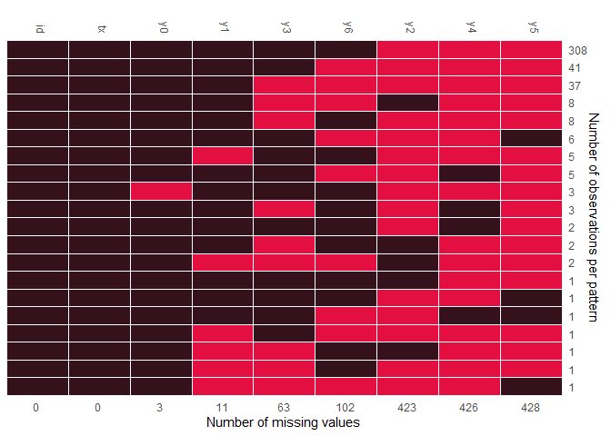

## Introduction to remiod

**remiod** is acronymed from
REference-based
Multiple Imputation of
Ordinal or Binary
variables (Wang and Liu 2022). The purpose of the package is to
facilitate the implementation of sensitivity analyses to ordinal/binary
response variable with missingness.

Missing data are common in randomised controlled trials (RCTs) and can
bias results if not handled appropriately. A statistically valid
analysis under the primary missing-data assumptions, usually missing at
random (MAR), can be planned, followed by sensitivity analyses under
alternative justified assumptions to assess the robustness of results.
Reference-based Multiple Imputation (MI) and delta adjustment procedures
thus have been developed for analysis under missing-not-at-random (MNAR)
assumptions.Tools in this package are developed specifically for
reference-based analyses of binary or ordinal responses.

In this vignette, we use the [Schizophrenia](https://hedeker.people.uic.edu/ml.html) data which is a part of the
**remiod** package. For more info on this data set, check the help file
or visit the following [link](https://hedeker.people.uic.edu/ml.html).
The original data is in a long format from a clinical trial, i.e. one
row per patient per visit. We first reshape it into a wide format.

    data(schizo)

    schizow = dcast(schizo, id + tx ~ week, value.var = "imps79o")
    colnames(schizow) = c(colnames(schizow)[1:2], paste0("y",colnames(schizow)[-c(1:2)]))
    schizow = as.data.frame(schizow)
    schizow[,colnames(schizow)[-c(1:2)]] = lapply(schizow[,colnames(schizow)[-c(1:2)]], 
                                   function(x) factor(x, levels = c("1", "2", "3", "4"), ordered=TRUE))

    head(schizow) %>% kbl(align = "c") %>% 
      kable_classic(full_width = F, html_font = "Cambria") %>%
      column_spec(1:2, width = "2cm") %>%
      add_header_above(c(" " = 1," "=1, "Responses at the baseline, week 1- week 6" = 7))

<table class=" lightable-classic" style="border-top: 2px solid #111111; border-bottom: 2px solid #111111; font-family: Cambria; width: auto !important; margin-left: auto; margin-right: auto;">
<thead style="border-bottom: 2px solid #111111;">
<tr>
<th style="empty-cells: hide;" colspan="1">
</th>
<th style="empty-cells: hide;" colspan="1">
</th>
<th style="border-bottom: 2px solid #111111; padding-left:3px;padding-right:3px;text-align: center; " colspan="7">
Responses at the baseline, week 1- week 6
</th>
</tr>
<tr>
<th style="text-align:center;">
id
</th>
<th style="text-align:center;">
tx
</th>
<th style="text-align:center;">
y0
</th>
<th style="text-align:center;">
y1
</th>
<th style="text-align:center;">
y2
</th>
<th style="text-align:center;">
y3
</th>
<th style="text-align:center;">
y4
</th>
<th style="text-align:center;">
y5
</th>
<th style="text-align:center;">
y6
</th>
</tr>
</thead>
<tbody>
<tr>
<td style="text-align:center;width: 2cm; ">
1103
</td>
<td style="text-align:center;width: 2cm; ">
1
</td>
<td style="text-align:center;">
4
</td>
<td style="text-align:center;">
2
</td>
<td style="text-align:center;">
NA
</td>
<td style="text-align:center;">
2
</td>
<td style="text-align:center;">
NA
</td>
<td style="text-align:center;">
NA
</td>
<td style="text-align:center;">
2
</td>
</tr>
<tr>
<td style="text-align:center;width: 2cm; ">
1104
</td>
<td style="text-align:center;width: 2cm; ">
1
</td>
<td style="text-align:center;">
4
</td>
<td style="text-align:center;">
2
</td>
<td style="text-align:center;">
NA
</td>
<td style="text-align:center;">
1
</td>
<td style="text-align:center;">
NA
</td>
<td style="text-align:center;">
NA
</td>
<td style="text-align:center;">
2
</td>
</tr>
<tr>
<td style="text-align:center;width: 2cm; ">
1105
</td>
<td style="text-align:center;width: 2cm; ">
1
</td>
<td style="text-align:center;">
2
</td>
<td style="text-align:center;">
2
</td>
<td style="text-align:center;">
NA
</td>
<td style="text-align:center;">
1
</td>
<td style="text-align:center;">
NA
</td>
<td style="text-align:center;">
NA
</td>
<td style="text-align:center;">
NA
</td>
</tr>
<tr>
<td style="text-align:center;width: 2cm; ">
1106
</td>
<td style="text-align:center;width: 2cm; ">
1
</td>
<td style="text-align:center;">
2
</td>
<td style="text-align:center;">
1
</td>
<td style="text-align:center;">
NA
</td>
<td style="text-align:center;">
1
</td>
<td style="text-align:center;">
NA
</td>
<td style="text-align:center;">
NA
</td>
<td style="text-align:center;">
1
</td>
</tr>
<tr>
<td style="text-align:center;width: 2cm; ">
1107
</td>
<td style="text-align:center;width: 2cm; ">
0
</td>
<td style="text-align:center;">
3
</td>
<td style="text-align:center;">
3
</td>
<td style="text-align:center;">
NA
</td>
<td style="text-align:center;">
3
</td>
<td style="text-align:center;">
NA
</td>
<td style="text-align:center;">
NA
</td>
<td style="text-align:center;">
4
</td>
</tr>
<tr>
<td style="text-align:center;width: 2cm; ">
1108
</td>
<td style="text-align:center;width: 2cm; ">
1
</td>
<td style="text-align:center;">
4
</td>
<td style="text-align:center;">
4
</td>
<td style="text-align:center;">
NA
</td>
<td style="text-align:center;">
2
</td>
<td style="text-align:center;">
NA
</td>
<td style="text-align:center;">
NA
</td>
<td style="text-align:center;">
3
</td>
</tr>
</tbody>
</table>

`tx` is the treatment variable with 1 being treated and 0 being placebo.
`y0`,`y1`,…,`y6` are the response variables from baseline (visit=0) to
visit 6. First, we check the missing pattern of variables in this data
using function `md_pattern` from `JointAI`.

Figure 1. Missing pattern of Schizophrenia data

Figure 1 indicates there were missing values on the
response variable at each visit from the baseline to the last visit.
Applying sequential modeling method described by Tang (Tang 2018),
`remiod` function can be set up as follows:

    test = remiod(formula = y6 ~ tx + y0 + y1 + y2 + y3 + y4 + y5, data=schizow,
                  trtvar = 'tx', algorithm = "jags", method = "MAR", 
                  n.iter = 0, warn = FALSE, mess = FALSE) 
    list.models(test)
    
    >   Order model_formula                        
    > 1 1     y0 ~ tx                              
    > 2 2     y1 ~ tx + y0                         
    > 3 3     y3 ~ tx + y0 + y1                    
    > 4 4     y2 ~ tx + y0 + y1 + y3               
    > 5 5     y4 ~ tx + y0 + y1 + y2 + y3          
    > 6 6     y5 ~ tx + y0 + y1 + y2 + y3 + y4     
    > 7 7     y6 ~ tx + y0 + y1 + y2 + y3 + y4 + y5

In the default setting, the sequence of models are ordered based on the
number of missingness on each variables, which leads to the model on
`y3` (the number of missing values is 63 as showed in Figure 1) 
preceding to the model on `y2` (the number of missing
values is 423 as showed in Figure 1). In case the
sequence of models is expected to follow time order of visits, option
`model_order = paste0("y",0:5)` can be added to specify the model order
as `y0`, `y1`, `y2`, `y3`, `y4`, and `y5`, for example:

    test_ord = remiod(formula = y6 ~ tx + y0 + y1 + y2 + y3 + y4 + y5, data=schizow,
                      trtvar = 'tx', algorithm = "jags", model_order = paste0("y",0:5),  
                      method = "MAR", n.iter = 0, warn = FALSE, mess = FALSE) 
    list.models(test_ord)
    
    >   Order model_formula                        
    > 1 1     y0 ~ tx                              
    > 2 2     y1 ~ tx + y0                         
    > 3 3     y2 ~ tx + y0 + y1                    
    > 4 4     y3 ~ tx + y0 + y1 + y2               
    > 5 5     y4 ~ tx + y0 + y1 + y2 + y3          
    > 6 6     y5 ~ tx + y0 + y1 + y2 + y3 + y4     
    > 7 7     y6 ~ tx + y0 + y1 + y2 + y3 + y4 + y5

Argument `method` in `remiod` function is the place to request
controlled multiple imputation. `method = "MAR"` in the example setting
above will give imputation based on MAR assumption. Other options
include `J2R` (Jump to Reference), `CR` (Copy Reference), and `delta`
(delta adjustment).Theoretic aspects of these methods can be found in
Tang (2018).

    test_mar = remiod(formula = y6 ~ tx + y0 + y1 + y3, data = schizow, trtvar = 'tx', 
                      algorithm = "jags", method = "MAR", ord_cov_dummy = FALSE, 
                      n.iter = 2000, n.adapt = 2000, n.chains = 2, warn = FALSE, mess = FALSE) 

Function `extract_MIdata` can be used to extract an expected number, say
`M = 10`, of imputed data sets following MCMC sampling of `remiod`.
Argument `minspace` sets the distance, i.e. the number of iterations,
between two subsequently selected MCMC samples. If post-processing MCMC
samples is required, it can be set through argument `mi.setting`. For
example, `mi.setting = list(exclude_chains=2)` requests to exclude the
second chain of MCMC samples.

    extdt = extract_MIdata(object=test_mar, method="J2R",mi.setting=NULL, M=10, minspace=2)
    table(extdt[[1]]$Imp_)
    > 
    >   1   2   3   4   5   6   7   8   9  10 
    > 437 437 437 437 437 437 437 437 437 437

## References

Tang 2018. “Controlled Pattern Imputation for Sensitivity Analysis of
Longitudinal Binary and Ordinal Outcomes with Nonignorable Dropout.”
[*Statistics in Medicine* 37 (9): 1467–81](https://doi.org/10.1002/sim.7583).

Wang and Liu. 2022. “Remiod: Reference-Based Controlled Multiple
Imputation of Longitudinal Binary and Ordinal Outcomes with
Non-Ignorable Missingness.” [*arXiv 2203.02771*](https://arxiv.org/abs/2203.02771).
